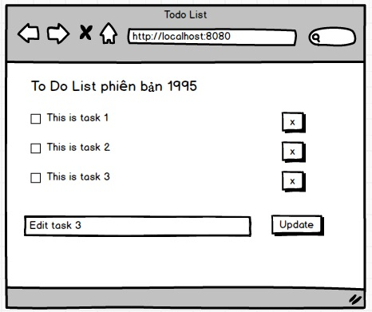

# Basic
## 1. GET Method
### 1.1 Hello World
Chạy web app ở cổng 8080, khi người dùng vào http://localhost:8080 thì thấy web page có dòng chữ HelloWorld


Hãy thử nghiệm và demo chức năng hot reload nếu web framework hỗ trợ
### 1.2 Get method không tham số
Ứng dụng web ở cổng 8080 trả về web page ở 2 đường dẫn
```
/
/aboutus
```
### 1.3 Get method có tham số
Ứng dụng web ở cổng 8080 trả về web page ở 3 đường dẫn. Hai đường dẫn đầu như ví dụ trước
```
/
/aboutus
```
Truyền vào tham số URL param để in màn hình
```/say?name=Tom```

### 1.4 Đọc URL parameter để xử lý logic
/info?type
```
case type == 'os' then
   hiển thị tên hệ điều hành (dùng hàm để lấy đừng gán constant string)
case type == 'framework" then
   hiển thị tên web framework + version
case type == 'date' then
   lấy thời gian trên server hiển thị
```

### 1.6 Chuyển hướng trên server - Server side redirect
```GET /old``` hãy chuyển địa chỉ ```/new```
Hãy thử tiếp từ ```/new``` lại chuyển về ```/old```
Tham khảo [server side redirect](https://en.wikipedia.org/wiki/Server-side_redirect)

### 1.7 Lỗi 404
Hãy tạo một trang báo lỗi thay thế cho lỗi 404
```
      .o     .oooo.         .o   
    .d88    d8P'`Y8b      .d88   
  .d'888   888    888   .d'888   
.d'  888   888    888 .d'  888   
88ooo888oo 888    888 88ooo888oo 
     888   `88b  d88'      888   
    o888o   `Y8bd8P'      o888o  
```
Tham khảo [Lỗi 404](https://en.wikipedia.org/wiki/HTTP_404)

### 1.8 REST API trả về JSON
```GET /books``` trả về danh sách các quyển sách

```JSON
[{
  "id": 1,
  "title": "Educated: A Memoir",
  "author": "Tara Westover"
}, {
  "id": 2,
  "title": "The Great Alone",
  "author": "Kristin Hannah"
}, {
  "id": 3,
  "title": "The Feather Thief",
  "author": "Kirk Wallace Johnson"
}, {
  "id": 4,
  "title": "The Woman in the Window",
  "author": "A.J. Finn"
}]
```
Dữ liệu gốc tham khảo ở đây [Best books of 2018 so far, according to Amazon](https://mashable.com/2018/06/19/best-books-2018-amazon/#7MBooA4oIqq0)
### 1.9 Liệt kê file trong thư mục
```/``` liệt kê tất các file trong thư mục, có link tải về được ở mỗi tên file
hint: Hãy sử dụng hàm có sẵn của web framework sau đó mới tự lập trình
dùng hàm API để liệt kê thư mục rồi trả về. Xem ví dụ dưới
```
.
├── Basic.md
├── LICENSE
├── MiniProject.md
├── Project.md
└── ReadMe.md

0 directories, 5 files
```

### 1.10 Liệt kê cả file và folder trong thư mục (Khó)
```/``` liệt kê tất các file, folder trong thư mục. Click vào folder sẽ mở ra thư mục sâu hơn.
Click vào parent sẽ ra thư mục cha
## 2. View Template căn bản
### 2.1 Truyền tham số qua URL Parameter tính chỉ số BMI
``` GET /bmi?name=John&weigh=75&heigh=175```
Hãy in ra màn hình sử dụng view template có 4 place holders:
- name
- weight (kg)
- height (cm)
- BMI index
Tham khảo chỉ số Body Mass Index [BMI](https://en.wikipedia.org/wiki/Body_mass_index)

## 3. POST Method
### 3.1 Cộng 2 số
```GET /add``` hiển thị form gồm 2 trường A và B, ấn nút submit trả về kết quả như sau ```A + B = C```
Nâng cao:
- Kiểm tra dữ liệu nhập vào tại server, nếu tham số không có dạng số hãy báo lỗi
- Bổ xung thêm ```/minus``` và ```/multiply``` để trừ và nhân
### 3.2 Form tính chỉ số BMI


### 3.3 Login form user name, password

```GET /login``` hiển thị form login gồm user name và password

```POST /login``` người dùng gửi lên user name và password
Server có sẵn các bộ dữ liệu ```{name, password}``` gồm có ```[{'admin', '@123'}, {'bob', '#321'}, {'jane', 'bob'}]```
```
if login == thành công then
  redirect sang một trang /loginsuccess
else
  redirect sang một trang /loginfail
endif
```
### 3.4 Upload một file
```POST \upload``` Upload một file bất kỳ lên server, trả về link để tải file đó về.
Cải tiến server để chỉ cho phép upload file ảnh *.png, *.jpg, *.gif, kích thước file dưới 500 Kbytes


### 3.5 Upload nhiều file mp3
```POST \uploads``` Upload nhiều file mp3 trả về danh sách các file upload thành công
Ấn vào link có thể nghe nhạc


### 3.6 Upload avatar


### 3.7 Todo List theo kiểu multi pages
Todo List sử dụng cổ điển, reload lại trang mỗi khi thực hiện một hành động:
- Thêm task mới
- Xoá task hiện tại
- Bật tắt check box bên trái task để đánh dấu task hoàn thành hay chưa hoàn thành
- Ấn vào task thì chuyển sang chế độ edit
```
   task {
     id: integer //id định danh cho từng task
     title: string //mô tả từng task
     done: bool //true nếu đã xong
   }
```
Chú ý không sử dụng CSDL, mà hãy dùng mảng để lưu danh sách tác vụ




Hint: hãy tạo các handler. Việc tạo mã HTML hãy code thủ công không sử dụng View Template

```
GET /  trả về danh sách các task
GET /task?id= trả về 1 task có ID
POST /task nếu không có id tạo mới một task
PUT /task cập nhật một task có sẵn, cần truyền vào id. Sửa title hoặc cập nhật done or not
DELETE /task truyền vào id của task
```

## 4. REST API cơ bản
### 4.1 REST Todo List không cần database
Ở server hãy tạo REST API cho ứng dụng Todo List.
```
GET /  trả về danh sách các task
GET /task?id= trả về 1 task có ID
POST /task nếu không có id tạo mới một task
PUT /task cập nhật một task có sẵn, cần truyền vào id. Sửa title hoặc cập nhật done or not
DELETE /task truyền vào id của task
```

### 4.2 Kết hợp AJAX với REST
Sử dụng thư viện jQuery để viết lại ứng dụng ToDoList với điều kiện không được load lại trang

Tham khảo thêm [ví dụ TodoList viết bằng jQuery và HandleBar.js](http://todomvc.com/examples/jquery/#/active)

### 4.3 Gọi đến REST API server ngoài
Viết ToDo List chỉ liệt kê tác vụ phần back end gián tiếp gọi đến một REST API khác trên Internet.
Hãy lấy dữ liệu từ [jsonplaceholder](https://jsonplaceholder.typicode.com/todos)


Dữ liệu là 100 bản ghi todo list
```json
[
  {
    "userId": 1,
    "id": 1,
    "title": "delectus aut autem",
    "completed": false
  },
  {
    "userId": 1,
    "id": 2,
    "title": "quis ut nam facilis et officia qui",
    "completed": false
  },
  {
    "userId": 1,
    "id": 3,
    "title": "fugiat veniam minus",
    "completed": false
  },
```
### 4.4 Web site lấy dữ liệu dự báo thời tiết từ Accuweather
Accuweather có gói miễn phí cung cấp dự báo thời tiết qua REST. Chỉ cần đăng ký tài khoản có APIKey là gọi được. Tạo web app lấy dữ liệu từ Accuweather hiển thị các thông tin:
- Địa điểm
- Nhiệt độ
- Độ ẩm
- Dự báo mưa, nắng, sấm chớp bằng ảnh icon lấy từ iconfinder.com


### 4.5 Viết REST API Handler chấp nhận file binary upload
Viết một REST API handler để có thể upload file + truyền một số tham số lên server.
Nếu upload thành công thì trả về thông báo.
Chú ý sử dụng AJAX call vào REST API này

## 5. Session
### 5.1 Dùng session lưu biến counter
In ra màn hình biến counter tăng mỗi khi refresh web site.
Yêu cầu sử dụng session để lưu biến counter


### 5.2 Dùng Session để lưu login user
Màn hình đâu tiên khi người dùng chưa đăng nhật sẽ không nhìn thấy dữ liệu mà chỉ
có link để chuyển sang màn hình login


Màn hình login


Nếu login không thành công thì reload lại trang này, nếu thành công thì quay lại trang chủ


### 5.3 Dùng session lưu giỏ hàng (ứng dụng Multiple Web Page)
Web bán hàng đơn giản gồm 2 trang: trang chủ và trang đặt hàng.
Trang chủ hiện ra danh sách 4 mặt hàng dạng hyper link: Tivi, Tủ lạnh, Máy Giặt, Xe máy
Người mua click vào link, coi là hành động đặt mua. Click nhiều lần thì tăng thêm số lượng mua.
Hãy lưu danh sách mặt hàng khách hàng mua vào session để khi chuyển sang trang giỏ hàng

```http://localhost:8080/```


```http://localhost:8080/giohang/```


### 5.4 Dùng Redis để lưu session
Nhiều web framework cho phép sử dụng Redis để lưu session. Hãy nâng cấp ứng dụng 'Dùng session lưu giỏ hàng' thay vì dùng đối tượng session in memory sang dùng Redis


## 6 Cookie
### 6.1 Lưu lựa chọn người dùng bằng cookie
Tạo một trang web chỉ có dòng text HelloWorld
Người ấn một trong hai nút để chọn theme backgroud. Tắt trình duyệt đi rồi mở lại sẽ
thấy lựa chọn theme được ghi nhớ lại


### 6.2 Dùng cookie lưu biến counter
Thay vì sử dụng session hãy dùng cookie để lưu biến cookie.
Trong ví dụ này dùng javascript để sửa đổi biến counter trong cookie. 
Mỗi lần trang web reload tăng biến counter lên 1 rồi lưu vào cookie.
Hãy thử hack biến counter bằng cách gán nó một giá trị bật kỳ

### 6.3 Cookie httpOnly = true vs false
Để không cho phép người dùng sửa đổi cookie hãy chỉ cho phép sửa đổi cookie từ server.

Tham khảo [Cookie](https://developer.mozilla.org/en-US/docs/Web/HTTP/Cookies)

## 7 Request Response
### 7.1 Set Content Type
Gọi vào một REST API Handler hãy trả dữ liệu về theo các định dạng sau:

1. JSON
```json
[{
  "id": 1,
  "first_name": "Ardella",
  "last_name": "Trood"
}, {
  "id": 2,
  "first_name": "Ludovika",
  "last_name": "Dewhirst"
}, {
  "id": 3,
  "first_name": "Joline",
  "last_name": "Webb-Bowen"
}, {
  "id": 4,
  "first_name": "Hyatt",
  "last_name": "Paskins"
}, {
  "id": 5,
  "first_name": "Sascha",
  "last_name": "Delatour"
}]
```
2. XML
```xml
<?xml version='1.0' encoding='UTF-8'?>
<dataset>
  <record>
    <id>1</id>
    <first_name>Jaimie</first_name>
    <last_name>Geertje</last_name>
  </record>
  <record>
    <id>2</id>
    <first_name>Skyler</first_name>
    <last_name>Weagener</last_name>
  </record>
  <record>
    <id>3</id>
    <first_name>Betteann</first_name>
    <last_name>Coppin</last_name>
  </record>
  <record>
    <id>4</id>
    <first_name>Wadsworth</first_name>
    <last_name>Manoelli</last_name>
  </record>
  <record>
    <id>5</id>
    <first_name>Ana</first_name>
    <last_name>Tradewell</last_name>
  </record>
</dataset>
```
3. TEXT/CSV
```csv
CSV
id,first_name,last_name
1,Isacco,Gulk
2,Rice,Atwood
3,Catina,Pauleau
4,Stanford,Jencey
5,Brandais,Crombie
```
### 7.2 GZip compession
Trả về dữ liệu dài > 100k gồm cả text và ảnh. Hãy bật và tắt chức năng nén Gzip
Sử dụng Chrome > More Tools > Developer Tools > Networks tab để dữ liệu tải về, thời gian

Hint: Dùng Mockaroo để sinh dữ liệu và lấy thêm 5 ảnh độ phân giải cao từ [unsplash.com](https://unsplash.com/)

Chú ý tắt chức năng cache của trình duyệt


### 7.3 Stream data từ web
Lập trình để trả về chuỗi số nguyên dương tuần tự từ 1, 2, 3, 4, 5... cách nhau 0.1 giây.
Trình duyệt cần hiển thị tuần tự dữ liệu trả về chứ không được gom đến gói dữ liệu cuối cùng rồi hiển thị

Tham khảo 
- [Chunked Tranfer Encoding](https://en.wikipedia.org/wiki/Chunked_transfer_encoding)
- [Ví dụ trả về dữ liệu cách nhau một khoảng thời gian](https://github.com/iris-contrib/examples/blob/master/http_responsewriter/stream-writer/main.go)

### 7.4 Cross-Origin Resource Sharing
Dựng hay web app ở 2 cổng khác nhau
- 8080: Trả về web page có jQuery, có lời gọi AJAX vào REST API ở cổng 8081
- 8081: REST API trả về dữ liệu JSON
Lời gọi từ 8080 đến 8081 sẽ là Cross Origin. Sẽ có 2 trường hợp xảy ra:
- 8081 chấp nhận CORS, lời gọi thành công
- 8081 không chấp nhận CORS, lợi gọi sẽ bị từ chối

```json
[{
  "id": 1,
  "title": "Goodbye Lover",
  "genre": "Comedy|Crime|Thriller"
}, {
  "id": 2,
  "title": "24 Exposures",
  "genre": "Crime|Drama|Thriller"
}, {
  "id": 3,
  "title": "Zatoichi and the Fugitives (Zatôichi hatashi-jô) (Zatôichi 18)",
  "genre": "Action|Adventure|Drama"
}, {
  "id": 4,
  "title": "Indiana Jones and the Temple of Doom",
  "genre": "Action|Adventure|Fantasy"
}, {
  "id": 5,
  "title": "Cutting Edge: Going for the Gold, The",
  "genre": "Comedy|Drama|Romance"
}]
```