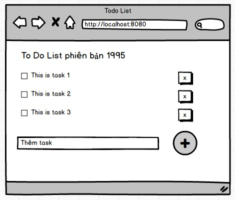

# MVC

Phần này sẽ chuyên các ví dụ minh hoạ cho Model - View - Controller. Trước khi học đến phần Model - View - Controller, sinh viên cần lập trình [căn bản](Basic.md) và khoá học Postgresql - MySQL - MongoDB.

Phần MVC sẽ tập trung vào kỹ thuật Server Side Rendering và Multi Pages App:
- Server Side Rendering: nội dung web site HTML được tạo nhờ Controller đổ dữ liệu từ Model vào View Template. View Template Engine có nhiệm vụ sản sinh ra HTML rồi trả về.

- Multi Pages App: Web app sẽ có nhiều trang (đường dẫn) khác với mô hình Single Page App, phần back end là REST API. MPA sẽ giúp SEO tốt hơn, caching tốt hơn.

Nếu các bạn có góp ý hãy email cho tôi tại địa chỉ cuong@techmaster.vn

## 1. Template
### 1.1 text place holder
Ví dụ 1: trang chủ có một ô text box, người dùng nhập tên rồi submit chuyển sang trang sau hiển thị tên vừa nhập. Trang số 2 sử dụng view template có place holder để hiển thị text

Bài tập: Viết lại ứng dụng tính chỉ số BMI sử dụng view template

### 1.2 for loop
Ví dụ 1: Cải tiến ứng dụng Todo List, phần hiển thị task hãy sử dụng for loop trong view template

Ví dụ 2: Gọi AJAX call đến  Unsplash API để tìm kiếm ảnh theo từ khoá.
Dữ liệu trả về sẽ được xuất ra web nhờ view template

### 1.3 if then else
Viết ứng dụng Todo List nhưng yêu cầu đăng nhập. Chưa cần sử dụng database ở backend.
Chỉ cần có 1 user 'bob', pass: '123'. Nếu chưa đăng nhập, thì chỉ có thể đọc danh sách các task, nhưng không thể sửa, thêm mới hoặc xoá.

Màn hình đăng nhập

Nếu đăng nhập thành công người dùng có thể thêm, sửa, xoá

### 1.4 Tái sử dụng template
header và footer của web site thường được lặp lại ở những trang web. Hãy biết header và footer thành template tái sử dụng được.

### 1.5 Kế thừa view template nếu có
Một số view template engine cho phép tạo ra một view component bằng cách kế thừa view component có sẵn

### 1.6 Hot reload view template nếu có
PHP, Node.js, Python, Golang có cơ chế hot reload: không cần biên dịch lại 

### 1.7 Gọi hàm từ trong view template nếu có

### 1.8 Cache View Template render nếu có

## 2. Model
### 2.1 Truyền 1 đối tượng model vào View

### 2.2 Truyền mảng đối tượng model vào View

### 2.3 Truyền cấu trúc quan hệ 1:N model vào View

## 3. Router - Controller

## 4. ORM

## 5. Singleton